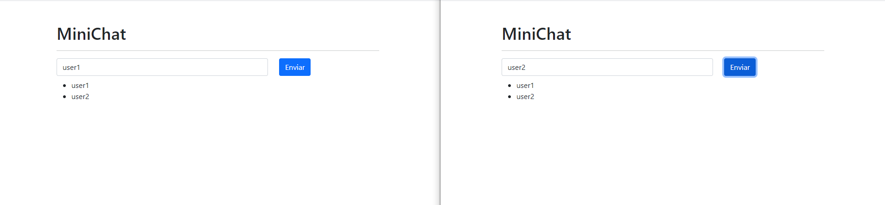

# Proyecto básico con socket io
# instalar dependencia
`npm install`
# ejecutar proyecto dentro de la carpeta 01-socket-server-basic
`npm start`

# url de la app
https://react-socket-server2.herokuapp.com/

